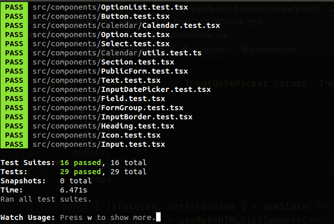

# front-end test for pipefy

**[ONLINE VERSION (HEROKU)](https://guilherme-na-pipefy.herokuapp.com/)**

This project was bootstrapped with [Create React App](https://github.com/facebook/create-react-app) and
has the following stack:

- React
- Apollo GraphQL
- Styled Components
- Storybook
- Jest
- @testing-library/react
- React Final Form

## preview

  

## styling

The style are simple because I focused more on the JavaScript (TypeScript, actually) code and the integration with Apollo/GraphQL.

## code style

I followed the [JavaScript Standard Style](https://standardjs.com/), my favorite code style, whose main features
are the absence of semicolons and trailing commas.

Here's a example:

  

## the InputDatePicker

I built an InputDatePicker from scratch for this project. It's simple, but it doesn't
depends on any third-party modules besides React itself, Styled Components for styling and the tiny and awesome [date-fns](https://date-fns.org/) for handling Date operations.

  

## tests

I'm running some tests with the Jest and @testing-library/react. Mostly components just have a simple rendering test and aren't as detailed as it should be.

  

## why I didn't use Redux

It's completely unnecessary. The FinalForm already keeps the form state and, besides that, [it's not good practice to keep form state in Redux](https://twitter.com/adielhercules/status/1157342550778359810).

I think that [Redux is overused](https://medium.com/@dan_abramov/you-might-not-need-redux-be46360cf367) (I did overuse it myself in many of my first projects) and it should only be used in some particular huge projects that need to share state across many components and has a complex store.

Besides that, [using local state is fine](https://twitter.com/dan_abramov/status/842326284533432320),
and if we need to share state between components, we can use patterns like [state lifting](https://reactjs.org/docs/lifting-state-up.html#lifting-state-up) or even the combination between [Context](https://reactjs.org/docs/context.html#when-to-use-context) and the amazing [Hooks](https://reactjs.org/docs/hooks-state.html).

And, if the project already use Apollo/GraphQL, it can also use the [Apollo Client to manage local stage with the local directives and cache writing](https://blog.apollographql.com/the-future-of-state-management-dd410864cae2), without the need of Redux.

To finish, I don't want this text to appear that I don't like Redux. I do like Redux, but I know how and when to use it.
