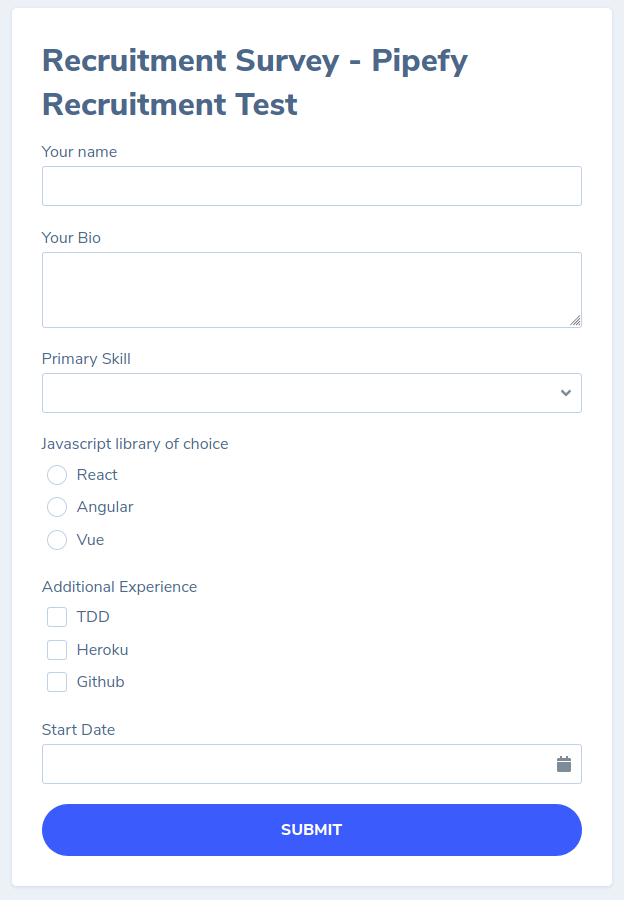
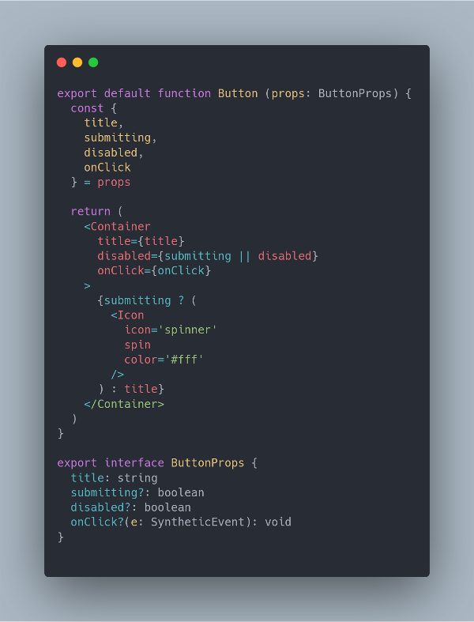
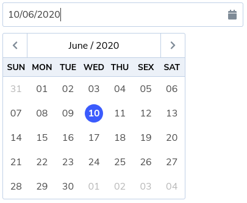

# front-end test for pipefy

**[ONLINE VERSION (HEROKU)](https://guilherme-na-pipefy.herokuapp.com/)**

This project was bootstrapped with [Create React App](https://github.com/facebook/create-react-app) and
has the following stack:

- React
- Apollo GraphQL
- Styled Components
- Storybook
- Jest
- @testing-library/react
- React Final Form

## preview

  

## about the style

The style are simple because I focused more on the JavaScript (TypeScript, actually) code and the integration with Apollo/GraphQL.

## about the code style

Semicolons (`;`) are like wisdom teeth or the appendix for the JavaScript: it's (almost) completely useless, an evolutionary vestige that the language inherited from primitives languages like C.

Because of that and other reasons, I followed the [JavaScript Standard Style](https://standardjs.com/).

> NOTE: I only use this particular code style for my own projects. If a company's project has a different code style, I respect and follow the project's code style because I believe that the project and the team is above my personal preferences.

Here's a code sample, without dirt like semicolons and trailing commas:

  

## about the InputDatePicker

I built an InputDatePicker from scratch for this project. It's simple, but I don't
depends on any third-party modules besides React itself, Styled Components for styling and the tiny and awesome [date-fns](https://date-fns.org/) for handling Date operations.

  

